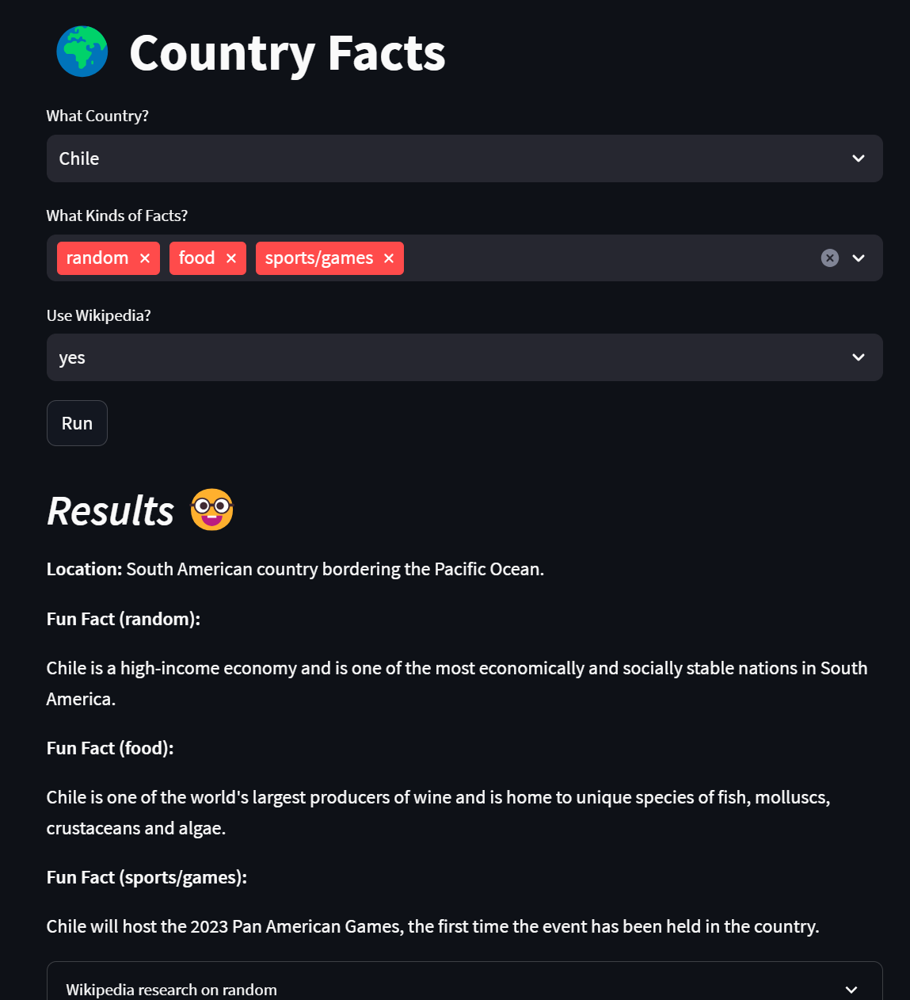

# Country Facts from GPT
Learn about any country through this GPT-based app!

1. Choose a country to see its location and fun facts about it.
2. Ask the app to search Wikipedia to mitigate hallucinations.
3. Select which kinds of facts you're interested in like culture, sports, etc.

Uses LangChain features including:
- Prompt Templates
- Wikipedia search.
- Memory buffer to memoize some results.

## Countries
The list of countries is scraped from [britanica.com](https://www.britannica.com/topic/list-of-countries-1993160) via the bash command:
```
curl https://www.britannica.com/topic/list-of-countries-1993160 | grep -oP "place/[a-zA-Z\-]+" | grep -oP "/[a-zA-Z\-]+" | tr -d '/' > countries.txt
```

## Running the App
```
# install Python modules, including lanchain, wikipedia, and streamlit
pip install -r requirements.txt
# run the app
streamlit run app.py
```

## Demo



## Prompt Engineering & Observations
### Coercing Format of Result
Provided examples to get short & sweet description of location:

Prompt:
```
You are an expert at describing the relative location of a country. Your descriptions are brief. For the final country below, provide response similar to the other examples:

COUNTRY: United States of America
LOCATION: One of three countries in North America.
COUNTRY: Japan
LOCATION: Eastern Asian country near China.
COUNTRY: Israel
LOCATION: Middle Eastern country adjacent to the Mediterannean Sea.

COUNTRY: {country}
LOCATION: 
```

### Hallucination from Article Extraction
To combat hallucination from article extraction, can augment the prompt with:
```
If the article does not mention anything about the topic of {fact_kind} related to the country of {country}, then you must say \"No mention of {fact_kind} in Wiki research for {country}\".
``````


#### Limitation of using outside Knowledge
Once got this response from the LLM, even though the article context did not discuss "free-ness" of education:
> Cuba is a multiethnic country with a diverse population and a strong emphasis on free education and healthcare.

Perhaps the response stemmed from model training on this [other article on Cuba](https://en.wikipedia.org/wiki/Education_in_Cuba), which says:
> Public Education in Cuba has always been free

### "Fun Fact" vs. "Fact"
Using "fun fact", the LLM seems to embellish/misunderstand the article in order to create a dramatic "fun fact".

Prompt:
```
... come up with a fun fact about the country of {country} ...
```

Changing the prompt to use just "fact", the LLM sticks more to the truth.

This finding was independent of temperature.

#### "Fun Fact" Embellishment: "the first"
Blindly stating that countries were the first to do something.

Wikipedia excerpt: 
> Cuba has a universal health care system which provides free medical treatment to all Cuban citizens.

Generated fun fact:
> Cuba was the first country in the world to grant free universal healthcare to its citizens.

#### "Fun Fact" Embellishment: "the only"
Blindly stating that countries are the only to do something.

Even with `temperature=0.3`, got the following.

Generated fun fact:
> Cuba is the only country in the world that has a planned economy and provides free medical treatment to all citizens.

Wikipedia excerpt:
> It has currently one of the world's few planned economies...Cuba has a universal health care system which provides free medical treatment to all Cuban citizens.

#### Using "Fact"
Factual summaries of the article used as context.

Example Response (`temperature=0.3`):
> Cuba is a multiethnic country with a diverse population and a strong emphasis on free education and healthcare.

Example Response:
> Cuba is a founding member of various international organizations, has one of the world's few planned economies, and provides universal health care to all citizens.

### Misinterpretations from High Temperature
Considering 0.9 to be high temperature (compared to 0.3).

#### Not Necessarily True Statement
Using "fact", the LLM assumed Cuban life expectancy is globally high because it is better than those of nearby regions.

Generated fun fact:
> Cuba has a high life expectancy, with citizens enjoying free medical care thanks to their universal healthcare system.

Wikipedia excerpt:
> performed better than other countries in the region on several socioeconomic indicators, such as literacy, infant mortality and life expectancy.

#### Outright Wrong
Using "fun fact" as well, the LLM blatantly misinterpreted the research article used as context.

Adding this sentence to the prompt:
```
The fact must be related to the topic of {fact_kind}.
```

Generated fun fact (when `fact_kind=food`):
> Cuba is the only nation to consistently vote against United Nations resolutions demanding an end to the US economic embargo, which has helped shape its unique cuisine by limiting imported ingredients.

Misinterpreting below Wikipedia research:
> United States embargo against Cuba Summary: The United States embargo against Cuba prevents U.S. businesses, and businesses organized under U.S. law or majority-owned by U.S. citizens, from conducting trade with Cuban interests. It is the most enduring trade embargo in modern history. The U.S. first imposed an embargo on the sale of arms to Cuba on March 14, 1958, during the Fulgencio Batista regime. Again on October 19, 1960, almost two years after the Cuban Revolution had led to the deposition of the Batista regime, the U.S. placed an embargo on exports to Cuba except for food and medicine after Cuba nationalized the US-owned Cuban oil refineries without compensation. On February 7, 1962, the embargo was extended to include almost all exports. The United Nations General Assembly has passed a resolution every year since 1992 demanding the end of the U.S. economic embargo on Cuba, with the U.S. and Israel being the only nations to consistently vote against the resolutions.
